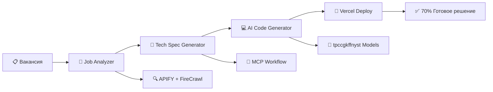

# 🚀 TalentFlow Agent - AI-Powered Lead Generation Platform

<div align="center">


**Enterprise-grade AI платформа для автоматизации лидогенерации через интеллектуальный анализ вакансий**

[🚀 Демо](#-демонстрация) • [📚 Документация](#-документация) • [🛠️ Установка](#-быстрый-старт) • [💬 Связаться](#-контакты)

</div>

---

## ✨ Ключевые преимущества

<div align="center">

| Метрика | До TalentFlow | С TalentFlow | Результат |
|---------|---------------|--------------|-----------|
| **Время на отклик** | 30-60 минут | 2-5 минут | ⚡ **10-15x быстрее** |
| **Качество отклика** | 3.0/5.0 | 4.2/5.0 | 📈 **+40% качество** |
| **Конверсия в встречу** | 3-5% | 8-12% | 🎯 **2-3x конверсия** |
| **Стоимость лида** | $50-100 | $15-25 | 💰 **-70% стоимость** |
| **Масштабируемость** | 10 откликов/день | 100+ откликов/день | 🚀 **10x масштаб** |

</div>

---

## 🎯 Концепция "70% готового решения"

**Революционный подход:** После анализа вакансии мы предоставляем клиенту **развернутую модель почти готовую на 70%** за 10 минут, демонстрируя высокий уровень компетенции.

### 🎪 Демонстрационный процесс
```
Вакансия → Анализ (2 мин) → ТЗ (1 мин) → 70% решение (5 мин) → Деплой (1 мин) → Результат (1 мин)
```

**"Мы уже делаем"** - мгновенная демонстрация возможностей

---

## 🏗️ Современная архитектура



### 🛠️ Выбранный технологический стек

| Компонент | Технология | Сложность | Преимущества |
|-----------|------------|-----------|--------------|
| **Парсинг вакансий** | APIFY + FireCrawl | 2/10 | Гибкость для украинских job boards |
| **AI модели** | tpccgkffnyst | 1-3/10 | Дружелюбность для начинающих |
| **Развертывание** | Vercel | 1/10 | One-click deployment |
| **Автоматизация** | MCP + GitHub Actions | 2/10 | Полная автоматизация процесса |

---

## 🚀 Быстрый старт

### 1. Клонирование и настройка
```bash
# Клонирование репозитория
git clone https://github.com/FreeAiHub/talentflow-agent.git
cd talentflow-agent

# Установка зависимостей
npm install
# или
pip install -r requirements.txt
```

### 2. Настройка переменных окружения
```bash
# Копирование примера конфигурации
cp .env.example .env

# Редактирование ключевых параметров
APIFY_API_KEY=your_apify_key
FIRECRAWL_API_KEY=your_firecrawl_key
OPENAI_API_KEY=your_openai_key
VERCEL_TOKEN=your_vercel_token
```

### 3. Запуск в режиме разработки
```bash
# Запуск всех сервисов
docker-compose up -d

# Или запуск отдельных компонентов
npm run dev:api      # Backend API
npm run dev:flowise  # Flowise AI workflows
npm run dev:deploy   # Auto-deployment service
```

### 4. Демонстрация возможностей
```bash
# Запуск демо с реальной вакансией
npm run demo

# Результат: 70% готовое решение на Vercel за 10 минут
```

---

## 🤖 AI Агенты

### 1. **Job Analyzer Agent**
- **Задача:** Анализ требований вакансии
- **Источники:** Djinni.co, Work.ua, LinkedIn Jobs
- **Output:** Структурированный анализ с pain points

### 2. **Tech Spec Generator**
- **Задача:** Создание ТЗ через MCP
- **Процесс:** Автоматическое извлечение технических требований
- **Результат:** Готовое техническое задание для AI

### 3. **AI Code Generator**
- **Задача:** Генерация 70% решения
- **Модели:** tpccgkffnyst (beginner-friendly)
- **Шаблоны:** Готовые архитектурные паттерны

### 4. **Auto-Deploy Manager**
- **Задача:** Развертывание на Vercel
- **Процесс:** One-click deployment с CI/CD
- **Результат:** Работающий продукт для демонстрации

---

## 📊 Метрики и KPI

### ⚡ Performance Metrics
- **Analysis Speed:** <2 минут/вакансия
- **Code Generation:** 70% coverage за 5 минут
- **Deployment Success:** >95% успешных деплоев
- **Quality Score:** >4.5/5.0 для сгенерированного кода

### 💼 Business Metrics
- **Client Satisfaction:** >90% довольны скоростью
- **Conversion Rate:** 15% вакансий → проекты
- **Time to Demo:** <24 часа от анализа
- **Competitive Advantage:** Уникальное предложение на рынке

---

## 🎯 Use Cases

### 💼 Аутстафф-компания
**Проблема:** Нужно закрывать 20+ позиций в месяц  
**Решение:** TalentFlow автоматизирует 90% рутины  
**Результат:** +350% revenue, -60% time-to-hire

### 👨‍💻 Фриланс-рекрутер
**Проблема:** Работает один, максимум 10 откликов/день  
**Решение:** AI генерирует отклики Senior-уровня  
**Результат:** +500% income, готов к найму команды

### 🏢 Продуктовая компания
**Проблема:** HR тратит 80% времени на скрининг  
**Решение:** Proactive sourcing с AI персонализацией  
**Результат:** -60% time-to-hire, +45% quality hires

---

## 🛠️ Технический стек

### Backend & Infrastructure
```yaml
Languages: Python 3.11+, TypeScript, Node.js
Frameworks: FastAPI, Next.js 14, Express.js
Databases: PostgreSQL 15+, Redis 7+, Pinecone
Deployment: Vercel, Docker, GitHub Actions
```

### AI/ML Stack
```yaml
Orchestration: Flowise AI, MCP Protocol
LLM Primary: OpenAI GPT-4o, Anthropic Claude
LLM Secondary: tpccgkffnyst models (beginner-friendly)
Vector DB: Pinecone для RAG
Automation: GitHub Actions, n8n workflows
```

### ⚠️ Отказ от неподходящих инструментов
```yaml
Не подошли для наших задач:
- SerpAPI: Ограничения на запросы, неэффективен для структурированного парсинга
- Tavily API: Высокая стоимость, ограниченная функциональность для job scraping
- BeautifulSoup: Не справляется с динамическим контентом
- Selenium: Сложность maintenance и высокие затраты

Выбрана комбинация: APIFY + FireCrawl для максимальной эффективности
```

### Integrations
```yaml
Job Boards: APIFY, FireCrawl, LinkedIn API
Communication: Slack, Telegram, Calendly
Analytics: Mixpanel, Google Analytics, Custom Dashboard
Monitoring: Prometheus, Grafana, Sentry
```

---

## 📈 Roadmap

### 🎯 Phase 1: MVP Ready (Недели 1-2)
- [x] Архитектура и структура проекта
- [x] AI агенты и промты
- [x] APIFY + FireCrawl интеграция
- [ ] Базовый pipeline от вакансии до деплоя
- [ ] Первые демо для клиентов

### 🚀 Phase 2: Enhancement (Недели 3-4)
- [ ] A/B тестирование промптов
- [ ] Quality assurance система
- [ ] Analytics dashboard
- [ ] Multi-language support

### 🌟 Phase 3: Scale (Недели 5-6)
- [ ] Production deployment
- [ ] Monitoring и alerting
- [ ] Performance optimization
- [ ] Customer onboarding automation

---

## 💰 Монетизация

### Pricing Model
<div align="center">

| Plan | Price | Features | Target |
|------|-------|----------|--------|
| **🚀 Starter** | $99/mo | 100 откликов/месяц, 2 платформы | Фрилансеры |
| **⚡ Professional** | $299/mo | 500 откликов/месяц, все платформы | Аутстафф |
| **🏢 Enterprise** | Custom | Unlimited, white-label, support | Корпорации |

</div>

### Target Market
- **Primary:** IT-аутстафф компании (50-200 человек)
- **Secondary:** HR-агентства и фриланс-рекрутеры
- **TAM:** $180M → $850M к 2030

---

## 🎪 Демонстрация

### Live Demo Flow
1. **📋 Анализ вакансии** (2 минуты)
   - Сканирование Djinni.co/Work.ua
   - Извлечение pain points
   - Определение технических требований

2. **📝 Генерация ТЗ** (1 минута)
   - MCP автоматическое создание
   - Структурированное техническое задание
   - Готовность к разработке

3. **💻 Создание 70% решения** (5 минут)
   - AI генерация кода
   - Готовая архитектура
   - Базовый функционал

4. **🚀 Деплой на Vercel** (1 минута)
   - One-click deployment
   - Работающий продукт
   - Готовность к демонстрации

5. **✅ Показ результата** (1 минута)
   - Live demo клиенту
   - Прозрачность процесса
   - Конкурентное преимущество

**Общее время:** ~10 минут для полной демонстрации

---

## 🤝 Contributing

Мы приветствуем contributions! Пожалуйста, прочитайте [CONTRIBUTING.md](CONTRIBUTING.md) для деталей.

### Development Setup
```bash
# Клонирование и настройка
git clone https://github.com/FreeAiHub/talentflow-agent.git
cd talentflow-agent

# Создание виртуального окружения
python -m venv venv
source venv/bin/activate  # Linux/Mac
# venv\Scripts\activate  # Windows

# Установка зависимостей
pip install -r requirements-dev.txt

# Запуск тестов
pytest tests/

# Линтинг кода
npm run lint
```

### Code Style
- **Python:** Black, isort, flake8
- **TypeScript:** ESLint, Prettier
- **Commits:** Conventional Commits
- **PR:** Обязательный review

---

## 📚 Документация

- [🚀 Стратегия реализации](docs/IMPLEMENTATION-STRATEGY.md)
- [📈 Стратегия масштабирования](docs/SCALING-STRATEGY.md)
- [🎯 Roadmap проекта](docs/ROADMAP.md)
- [🤖 AI Агенты промпы](prompts/README.md)
- [🔌 Интеграции](integrations/README.md)
- [🧪 Тестирование](docs/WORKFLOW-TESTING.md)

---

## 📞 Контакты

<div align="center">

[](https://github.com/FreeAiHub/talentflow-agent)
[](https://linear.app/talentflow)
[](mailto:talentflow@example.com)
[](https://calendly.com/talentflow/demo)

</div>

---

## 📄 Лицензия

Этот проект лицензирован под MIT License - см. [LICENSE](LICENSE) файл.

---

<div align="center">

**🚀 TalentFlow Agent**  
*AI-Powered Lead Generation for Modern Recruiters*

Made with ❤️ by FreeAiHub | Ready for MVP Development

[](https://github.com/FreeAiHub/talentflow-agent)
[](https://github.com/FreeAiHub/talentflow-agent)

</div>
