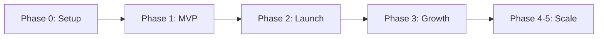

# 🗺️ TalentFlow Agent - Детальный Roadmap

**Версия:** 1.0  
**Дата создания:** 05 ноября 2025  
**Следующее обновление:** каждый понедельник

---

## 📅 Timeline Overview

```
Nov 2025          Dec 2025          Jan 2026          Feb-Apr 2026
   │                 │                 │                    │
Phase 0          Phase 1           Phase 2              Phase 3-5
Подготовка       MVP Dev           Launch            Scale & SaaS
```

---

## 🎯 Phase 0: Подготовка (Текущая фаза)

**Даты:** 04.11.2025 - 10.11.2025 (1 неделя)  
**Статус:** ✅ 50% завершено

### Задачи Week 1 (04-10 ноября)

| День | Задача | Статус | Ответственный |
|------|--------|--------|---------------|
| **Пн 04.11** | Setup Linear  | ✅ | Team |
| **Вт 05.11** | Создание проектной структуры | ✅ | Team |
| **Ср 06.11** | Анализ Djinni.co структуры | ⏳ | Dev |
| **Чт 07.11** | Исследование болей пользователей | 📝 | Research |
| **Пт 08.11** | Финализация tech spec | 📝 | Tech Lead |
| **Сб-Вс** | Документация и review | 📝 | Team |

### Deliverables Phase 0

- [x] Linear Project с 6 Milestones
- [x] 38 задач созданы и приоритизированы
- [x] GitHub репозиторий структурирован
- [x] Документация написана
- [ ] Djinni.co структура проанализирована
- [ ] User pain points задокументированы
- [ ] MVP Technical Spec финализирована

---

## 🚀 Phase 1: MVP Development

**Даты:** 11.11.2025 - 01.12.2025 (3 недели)  
**Цель:** Рабочий прототип с Djinni.co

### Week 2 (11-17 ноя): Базовая инфраструктура

**Milestone:** [TAL-28] Basic Infrastructure Setup

| Задача | Приоритет | Сроки | Результат |
|--------|-----------|-------|-----------|
| Docker setup | P0 | 11-12.11 | PostgreSQL + Redis running |
| Flowise deployment | P0 | 12-13.11 | Flowise на localhost:3000 |
| Claude API integration | P0 | 13-14.11 | API key настроен, тесты проходят |
| Database schema | P1 | 14-15.11 | Tables created, migrations ready |
| Git workflow | P1 | 15-17.11 | CI/CD базовый |

**Metrics:** Infrastructure up 99% uptime

### Week 3 (18-24 ноя): Парсинг и AI

**Milestone:** [TAL-29] Djinni.co Parser + [TAL-30] Flowise Chatflow

| Задача | Приоритет | Сроки | Результат |
|--------|-----------|-------|-----------|
| Djinni parser v1 | P0 | 18-20.11 | 100 вакансий спарсены |
| Vacancy Analyzer в Flowise | P0 | 20-21.11 | Чатфлоу работает |
| Response Generator | P0 | 21-22.11 | 2 варианта сообщений генерируются |
| DB integration | P1 | 22-24.11 | Данные сохраняются |

**Metrics:** 
- 100+ вакансий обработаны
- Lead scoring accuracy >80%
- Message quality >4/5

### Week 4 (25 ноя - 01 дек): Генерация и Automation

**Milestone:** [TAL-31] Response Generator + [TAL-32] Lead Scoring

| Задача | Приоритет | Сроки | Результат |
|--------|-----------|-------|-----------|
| Lead scoring algorithm | P0 | 25-26.11 | Score 1-10 работает |
| A/B testing setup | P1 | 26-27.11 | 2 варианта тестируются |
| Manual outreach test | P0 | 27-29.11 | 10 сообщений отправлено |
| Feedback collection | P1 | 29-01.12 | Response rate измерен |

**Metrics:**
- 10 откликов отправлено вручную
- Response rate >10%
- 3+ встречи забронированы

**Deliverables Phase 1:**
- ✅ Рабочий Djinni parser
- ✅ Flowise чатфлоу (Analyzer + Generator)
- ✅ PostgreSQL база с 100+ вакансиями
- ✅ 10 Real-world тестовых откликов
- ✅ Metrics dashboard (базовый)

---

## 🌐 Phase 2: Landing Page & Launch

**Даты:** 02.12.2025 - 22.12.2025 (3 недели)  
**Цель:** Публичный запуск + первые пользователи

### Week 5 (02-08 дек): Website Development

**Milestone:** [TAL-33] Landing Page

| Задача | Приоритет | Сроки | Результат |
|--------|-----------|-------|-----------|
| Landing page design | P0 | 02-03.12 | Figma mockups |
| Next.js setup | P0 | 03-04.12 | Frontend running |
| Content writing | P1 | 04-05.12 | Copy готов |
| SEO optimization | P1 | 05-06.12 | Meta tags, sitemap |
| Email capture | P0 | 06-08.12 | Form работает |

**URL:** talentflowagent.com (купить домен до 02.12)

### Week 6 (09-15 дек): Work.ua & LinkedIn Parsers

**Milestone:** [TAL-34] Work.ua Parser + [TAL-35] LinkedIn Parser

| Задача | Приоритет | Сроки | Результат |
|--------|-----------|-------|-----------|
| Work.ua parser | P1 | 09-11.12 | 50 вакансий |
| LinkedIn integration | P1 | 11-13.12 | JobSpy working |
| Multi-platform testing | P0 | 13-15.12 | 3 платформы работают |

**Metrics:** 300+ вакансий/день с 3 платформ

### Week 7 (16-22 дек): Pre-Launch & Testing

**Milestone:** [TAL-36] Analytics Dashboard + [TAL-37] Beta Testing

| Задача | Приоритет | Сроки | Результат |
|--------|-----------|-------|-----------|
| Dashboard frontend | P0 | 16-17.12 | UI готов |
| Analytics integration | P0 | 17-18.12 | Google Analytics + Mixpanel |
| Beta testers recruitment | P1 | 18-19.12 | 10 beta users |
| Bug fixes | P0 | 19-22.12 | Critical bugs fixed |
| Documentation | P1 | 20-22.12 | User guides |

**Deliverables Phase 2:**
- ✅ Публичный website talentflowagent.com
- ✅ 3 парсера working (Djinni, Work.ua, LinkedIn)
- ✅ Dashboard с аналитикой
- ✅ 10 beta testers onboarded
- ✅ Документация для юзеров

---

## 📈 Phase 3: Growth & Monetization

**Даты:** 23.12.2025 - 16.02.2026 (8 недель)  
**Цель:** 100 GitHub stars, первые платящие клиенты

### Month 2 (Jan 2026): Public Launch

**Week 8-9 (23.12 - 05.01):** Product Hunt Launch
- Pre-launch email list: 100+ signups
- Product Hunt submission 30.12.2025
- Goal: Top 5 Product of the Day

**Week 10-11 (06-19.01):** Growth Hacking
- Reddit posts (r/SaaS, r/opensource, r/recruiting)
- Hacker News (Show HN)
- LinkedIn marketing
- Blog posts (3 articles)

**Metrics Jan:**
- 100+ GitHub stars
- 200+ email signups
- 10 active users (free tier)
- 3 paying customers ($19-49/mo)
- $100 MRR

### Month 3 (Feb 2026): Feature Development

**Week 12-15 (20.01 - 16.02):** Advanced Features
- Calendly integration
- n8n automation
- A/B testing results analysis
- Self-hosted documentation

**Metrics Feb:**
- 300+ GitHub stars
- 500+ email signups
- 30 active users
- 15 paying customers
- $500 MRR

**Deliverables Phase 3:**
- ✅ Product Hunt launch (Top 5)
- ✅ 100+ GitHub stars
- ✅ 15 paying customers
- ✅ $500 MRR
- ✅ Community building started

---

## 🚀 Phase 4-5: Scale to SaaS

**Даты:** 17.02.2026 - 30.04.2026 (10 недель)  
**Цель:** $5K MRR, full SaaS platform

### Q1 2026 Milestones

**Month 4 (Mar):** SaaS Infrastructure
- Multi-tenant architecture
- Stripe integration
- User dashboard
- API v1

**Metrics Mar:**
- 50 customers
- $2,000 MRR
- 500+ GitHub stars

**Month 5 (Apr):** Enterprise Features
- White-label option
- Advanced analytics
- Team features
- API v2
- Mobile app (planning)

**Metrics Apr:**
- 100 customers
- $5,000 MRR
- 1,500 GitHub stars
- 5,000 email signups

**Deliverables Phase 4-5:**
- ✅ Full SaaS platform
- ✅ 100 paying customers
- ✅ $5,000 MRR
- ✅ Profitable
- ✅ Team of 2-3 people

---

## 📊 Success Metrics by Phase

| Metric | Phase 0 | Phase 1 | Phase 2 | Phase 3 | Phase 4-5 |
|--------|---------|---------|---------|---------|-----------|
| **GitHub Stars** | - | 10 | 50 | 100 | 1,500 |
| **Email Signups** | - | - | 100 | 200 | 5,000 |
| **Active Users** | - | - | 10 | 30 | 100 |
| **Paying Customers** | - | - | - | 3 | 100 |
| **MRR** | $0 | $0 | $0 | $100 | $5,000 |
| **Vacancies/day** | 0 | 100 | 300 | 500 | 1,000+ |

---

## 🎯 Critical Path



**Bottlenecks:**
- Week 3: Djinni parser quality
- Week 7: Beta testing feedback
- Week 8: Product Hunt launch
- Month 3: First paying customers

---

## 🔄 Review Schedule

**Daily:** Standup at 10:00
**Weekly:** Sprint review каждый понедельник
**Monthly:** Roadmap review последняя пятница месяца

**Next Review:** 11.11.2025 (начало Phase 1)

---

## 🎨 Visual Timeline

```
2025                                    2026
━━━━━━━━━━━━━━━━━━━━━━━━━━━━━━━━━━━━━━━━━━━━━
Nov    Dec    Jan    Feb    Mar    Apr    May
 │      │      │      │      │      │      │
 🔧     🚀     📈     💰     🏢     📱     ✨
Setup  Launch Growth  Money  SaaS   App   Scale

Phase0 Phase1 Phase2 Phase3  Phase4 Phase5
```

**Legend:**
- 🔧 Setup & Infrastructure
- 🚀 MVP & Launch
- 📈 Growth & Marketing
- 💰 Monetization
- 🏢 Enterprise Features
- 📱 Mobile & Scale
- ✨ Innovation

---

**Last Updated:** 05.11.2025  
**Maintained by:** Team Lead  
**Feedback:** GitHub Issues или Slack #roadmap
