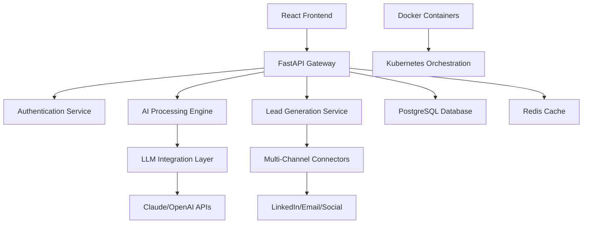

# 🚀 TalentFlow Agent

[](https://opensource.org/licenses/MIT)
[](https://www.python.org/downloads/)
[](https://fastapi.tiangolo.com)
[](https://reactjs.org/)
[](https://docker.com)
[](https://github.com/features/actions)
[](CONTRIBUTING.md)

> **Next-Generation AI-Powered Talent Acquisition & B2B Lead Generation Platform**

TalentFlow Agent is an advanced SaaS open-source platform that revolutionizes talent acquisition through intelligent automation, multi-channel lead generation, and AI-driven candidate matching. Built for modern HR teams and recruitment agencies.

## 🎯 **Core Features**

### 🤖 **AI-Powered Automation**
- **Smart Candidate Sourcing**: Automated multi-platform candidate discovery
- **Intelligent Resume Parsing**: NLP-powered CV analysis and skill extraction
- **AI Interview Scheduling**: Automated coordination with calendar integration
- **Predictive Candidate Scoring**: ML-based candidate-job matching algorithms

### 📊 **Multi-Channel Lead Generation**
- **LinkedIn Automation**: Smart outreach campaigns with personalization
- **Email Sequences**: Automated drip campaigns with A/B testing
- **Social Media Integration**: Cross-platform candidate engagement
- **CRM Sync**: Seamless integration with existing sales tools

### 💼 **Enterprise-Ready Features**
- **Team Collaboration**: Multi-user workspace with role-based permissions
- **Advanced Analytics**: Real-time recruitment metrics and ROI tracking
- **White-label Solutions**: Customizable branding for agencies
- **API-First Architecture**: Extensible integration ecosystem

## 🏗️ **Architecture Overview**



### **Tech Stack**

**Backend**
- **Python 3.11+** - Core runtime
- **FastAPI** - High-performance API framework
- **PostgreSQL** - Primary database with JSONB support
- **Redis** - Caching and session management
- **Celery** - Distributed task queue
- **SQLAlchemy** - ORM with async support

**Frontend**
- **React 18** - Modern UI framework
- **TypeScript** - Type-safe development
- **Tailwind CSS** - Utility-first styling
- **Vite** - Lightning-fast build tool
- **React Query** - Server state management

**AI & Integrations**
- **LangChain** - LLM orchestration
- **OpenAI/Claude APIs** - Advanced language models
- **Flowise Integration** - Visual workflow builder
- **Hugging Face Transformers** - NLP processing

**DevOps & Infrastructure**
- **Docker & Docker Compose** - Containerization
- **GitHub Actions** - CI/CD pipeline
- **Kubernetes** - Container orchestration
- **AWS/GCP Support** - Cloud deployment

## 🎨 **UI/UX Product Design**

### **Modern Dashboard Experience**
- **Dark/Light Mode**: Adaptive theme system
- **Responsive Design**: Mobile-first approach
- **Real-time Updates**: WebSocket-powered live data
- **Drag & Drop**: Intuitive candidate pipeline management
- **Advanced Filtering**: Multi-criteria search with saved views

### **Key User Interfaces**
1. **Candidate Dashboard** - 360° candidate view with AI insights
2. **Pipeline Manager** - Visual recruitment funnel with automation
3. **Analytics Hub** - Comprehensive metrics and reporting
4. **Campaign Builder** - No-code outreach sequence creator
5. **Integration Center** - One-click third-party connections

## 💡 **Competitive Advantage**

| Feature | TalentFlow Agent | BulkApply | JobCopilot | LazyApply |
|---------|------------------|-----------|------------|----------|
| **AI-Powered Matching** | ✅ Advanced ML | ❌ Basic | ❌ Limited | ❌ None |
| **Multi-Channel Outreach** | ✅ Full Suite | ❌ Email Only | ❌ Limited | ❌ Basic |
| **Real-time Analytics** | ✅ Comprehensive | ❌ Basic | ❌ Limited | ❌ None |
| **API-First Architecture** | ✅ Full REST/GraphQL | ❌ Limited | ❌ None | ❌ None |
| **Open Source** | ✅ MIT License | ❌ Proprietary | ❌ Proprietary | ❌ Proprietary |
| **White-label Support** | ✅ Enterprise | ❌ None | ❌ None | ❌ None |
| **Custom Workflows** | ✅ Flowise Integration | ❌ Fixed | ❌ Limited | ❌ None |
| **Enterprise Security** | ✅ SOC2 Ready | ❌ Basic | ❌ Basic | ❌ Basic |

## 🚧 **Pain Points We Solve**

### **For HR Teams**
- ❌ **Manual candidate sourcing** → ✅ **AI-powered discovery**
- ❌ **Scattered recruitment data** → ✅ **Unified dashboard**
- ❌ **Inconsistent outreach** → ✅ **Automated sequences**
- ❌ **Poor candidate experience** → ✅ **Personalized engagement**

### **For Recruitment Agencies**
- ❌ **Limited scalability** → ✅ **Multi-client management**
- ❌ **High operational costs** → ✅ **Automation-driven efficiency**
- ❌ **Lack of differentiation** → ✅ **AI-powered insights**
- ❌ **Manual reporting** → ✅ **Real-time analytics**

## 🗺️ **Product Roadmap**

### **MVP (Q1 2024)** ✅
- Core candidate management
- Basic AI matching
- LinkedIn integration
- Essential analytics

### **Pro (Q2 2024)** 🚧
- Advanced workflow automation
- Multi-channel outreach
- Team collaboration features
- Enhanced AI capabilities

### **Enterprise (Q3 2024)** 📋
- White-label solutions
- Advanced security features
- Custom integrations
- Dedicated support

### **Future Innovations** 🔮
- Video interview AI analysis
- Blockchain candidate verification
- Advanced predictive analytics
- Mobile-first recruiter app

## ⚡ **Quick Start**

### **Prerequisites**
- Python 3.11+
- Node.js 18+
- Docker & Docker Compose
- PostgreSQL 15+

### **1. Clone Repository**
```bash
git clone https://github.com/FreeAiHub/talentflow-agent.git
cd talentflow-agent
```

### **2. Environment Setup**
```bash
# Copy environment template
cp .env.example .env

# Configure your API keys
vim .env
```

### **3. Quick Deploy with Docker**
```bash
# Start all services
docker-compose up -d

# Initialize database
docker-compose exec api python -m alembic upgrade head

# Create superuser
docker-compose exec api python -m scripts.create_superuser
```

### **4. Development Setup**
```bash
# Backend setup
python -m venv venv
source venv/bin/activate  # On Windows: venv\Scripts\activate
pip install -r requirements.txt

# Frontend setup
cd frontend
npm install
npm run dev

# Start backend
cd ..
uvicorn src.main:app --reload
```

### **5. Access Application**
- **Frontend**: http://localhost:3000
- **API Docs**: http://localhost:8000/docs
- **Admin Panel**: http://localhost:8000/admin

## 📁 **Project Structure**

```
talentflow-agent/
├── 📂 src/                    # Backend source code
│   ├── 📂 api/                # FastAPI routes & middleware
│   ├── 📂 agents/             # AI agent implementations
│   ├── 📂 core/               # Core business logic
│   ├── 📂 models/             # Database models
│   ├── 📂 services/           # External service integrations
│   └── 📂 utils/              # Utility functions
├── 📂 frontend/               # React frontend application
│   ├── 📂 src/
│   │   ├── 📂 components/     # Reusable UI components
│   │   ├── 📂 pages/          # Page components
│   │   ├── 📂 hooks/          # Custom React hooks
│   │   └── 📂 utils/          # Frontend utilities
├── 📂 tests/                  # Comprehensive test suite
├── 📂 docs/                   # Documentation
├── 📂 scripts/                # Deployment & utility scripts
├── 📂 .github/                # GitHub workflows & templates
└── 📂 docker/                 # Docker configurations
```

## 🔧 **Best Practices Implementation**

### **Code Quality**
- **Type Safety**: Full TypeScript + Pydantic validation
- **Code Formatting**: Black, Prettier, ESLint
- **Testing**: 90%+ coverage with pytest & Jest
- **Documentation**: Auto-generated API docs

### **Security**
- **Authentication**: JWT + OAuth2 integration
- **Authorization**: Role-based access control (RBAC)
- **Data Protection**: Encryption at rest and in transit
- **Compliance**: GDPR and SOC2 ready

### **Performance**
- **Caching**: Multi-layer Redis caching strategy
- **Database**: Optimized queries with connection pooling
- **API**: Rate limiting and request optimization
- **Frontend**: Code splitting and lazy loading

## 🤝 **Contributing**

We welcome contributions! Please see our [Contributing Guidelines](CONTRIBUTING.md) for details.

### **Development Process**
1. Fork the repository
2. Create a feature branch (`git checkout -b feature/amazing-feature`)
3. Commit your changes (`git commit -m 'Add amazing feature'`)
4. Push to the branch (`git push origin feature/amazing-feature`)
5. Open a Pull Request

### **Code Standards**
- Follow [PEP 8](https://pep8.org/) for Python
- Use [Conventional Commits](https://www.conventionalcommits.org/)
- Write comprehensive tests
- Update documentation

## 📚 **Documentation**

- 📖 [**Full Documentation**](https://docs.talentflow-agent.com)
- 🏗️ [**Architecture Guide**](docs/architecture.md)
- 🔌 [**API Reference**](https://api.talentflow-agent.com/docs)
- 🚀 [**Deployment Guide**](docs/deployment.md)
- 🧪 [**Testing Guide**](docs/testing.md)

## 🎮 **Live Demo**

- 🌐 [**Live Demo**](https://demo.talentflow-agent.com)
- 📱 [**Mobile App**](https://app.talentflow-agent.com)
- 🎥 [**Video Tour**](https://youtube.com/watch?v=talentflow-demo)

## 📊 **Community & Support**

- 💬 [**Discord Community**](https://discord.gg/talentflow)
- 🐛 [**Bug Reports**](https://github.com/FreeAiHub/talentflow-agent/issues)
- 💡 [**Feature Requests**](https://github.com/FreeAiHub/talentflow-agent/discussions)
- 📧 [**Enterprise Support**](mailto:enterprise@talentflow-agent.com)

## 📄 **License**

This project is licensed under the MIT License - see the [LICENSE](LICENSE) file for details.

## 🌟 **Star History**

[](https://star-history.com/#FreeAiHub/talentflow-agent&Date)

---

<div align="center">
  <strong>Built with ❤️ by the TalentFlow Team</strong><br>
  <a href="https://talentflow-agent.com">Website</a> • 
  <a href="https://twitter.com/talentflow_ai">Twitter</a> • 
  <a href="https://linkedin.com/company/talentflow">LinkedIn</a>
</div>
