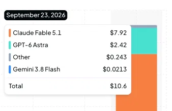
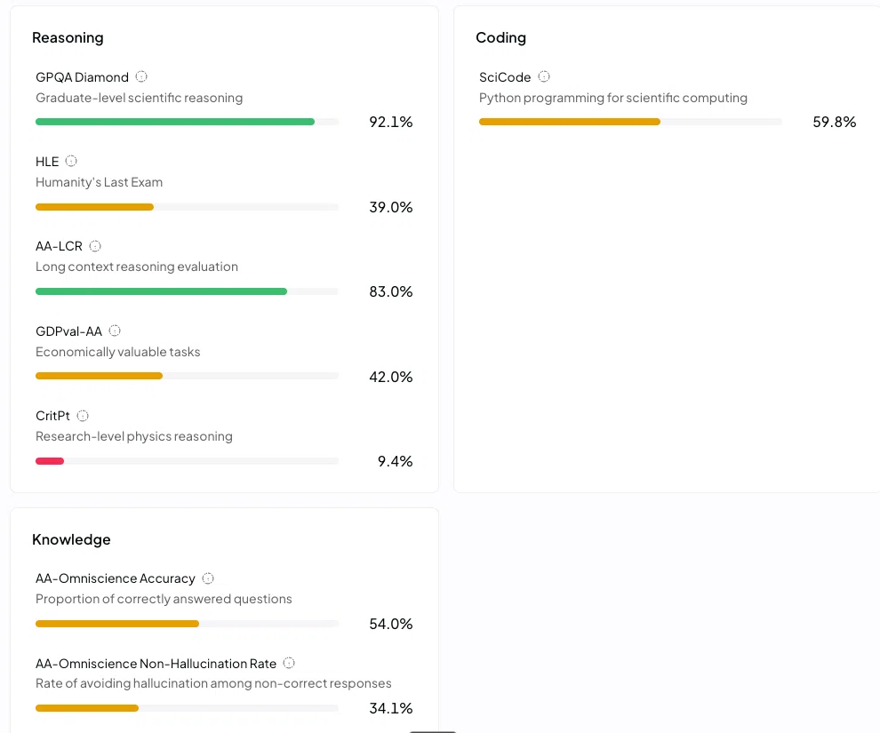

# 🔄 Ротация моделей

> **Принцип: дорогая модель — только там, где дешёвая доказанно не справляется.**
> Не «на всякий случай возьмём посильнее», а «эта задача провалилась на дешёвой,
> поднимаем на ступень».
>
> Обновлено 23.09.2026. Цены сверены с `openrouter.ai/api/v1/models`.

---

## Почему это вообще понадобилось

Замер расхода за 23.09.2026:



| Модель | Расход | Доля |
|--------|--------|------|
| Claude Fable 5.1 | $7.92 | 75% |
| GPT-6 Astra | $2.42 | 23% |
| Other | $0.243 | 2% |
| Gemini 3.8 Flash | $0.0213 | 0.2% |
| **Итого** | **$10.6** | |

**98% расхода дали две самые дорогие модели.** При этом основную работу —
чтение файлов, правки, прогоны тестов — они не делали лучше, чем сделала бы
модель в 30–80 раз дешевле. Мы платили за потолок качества там, где он не
использовался.

---

## Цены: проверено 23.09.2026

За 1 млн токенов, вход / выход. Источник — `openrouter.ai/api/v1/models`.

| Модель | Вход | Выход | Во сколько раз дешевле GPT-6 Astra | Роль |
|--------|------|-------|-----------------------------------|------|
| `deepseek/deepseek-v4-flash-0731` | $0.04 | $0.64 | **≈78×** | рабочая лошадь, дефолт |
| `deepseek/deepseek-v4-flash` | $0.09 | $0.17 | ≈30× | |
| `xiaomi/mimo-v2.5` | $0.14 | $0.28 | **≈50×** | дешёвый универсал, 1M контекста |
| `z-ai/glm-5.3-flash` | $0.15 | $0.50 | ≈40× | быстрый, 1.3M контекста |
| `qwen/qwen3.8-flash` | $0.15 | $0.47 | ≈40× | |
| `deepseek/deepseek-v4.1-flash` | $0.15 | $0.60 | ≈33× | **оркестратор** |
| `openai/gpt-5.6-luna` | $0.20 | $1.20 | ≈20× | дешёвый OpenAI |
| `z-ai/glm-5.3` | $0.56 | $1.76 | ≈8× | 1.3M контекста |
| `google/gemini-3.8-flash` | $0.75 | $3.75 | ≈6× | 1M контекста, картинки |
| `tencent/hy4-preview` | $0.83 | $2.50 | ≈6× | |
| `x-ai/grok-4.6` | $2.00 | $6.00 | ≈4× | свежий Grok |
| `qwen/qwen3.8-max-0902` | $2.00 | $6.00 | ≈4× | |
| `openai/gpt-5.6-sol` | $2.00 | $10.00 | ≈2.5× | флагман OpenAI |
| `moonshotai/kimi-k3` | $3.00 | $15.00 | ≈1.3× | |
| `anthropic/claude-fable-5.1` | $10.00 | $50.00 | 1× | самый надёжный в инструментах |
| `openai/gpt-6-astra` | $10.00 | $50.00 | — | эталон |

**Разрыв между верхом и низом — 250× по входу и 78× по выходу.** Это не
погрешность, это решение о том, во сколько обходится проект.

---

## Лестница ротации

```
ступень 0  deepseek-v4-flash-0731      $0.04/$0.64    всё, что можно
   │  не справился
ступень 1  mimo-v2.5 / glm-5.3-flash    $0.14/$0.28   сложнее, но шаблонно
   │  не справился
ступень 2  qwen3.8-flash / gpt-5.6-luna $0.15/$1.20   нужен другой взгляд
   │  не справился
ступень 3  grok-4.6 / qwen3.8-max       $2.00/$6.00   длинный контекст, нестандарт
   │  не справился
ступень 4  gpt-5.6-sol / kimi-k3        $2–3/$10–15   задача реально тяжёлая
   │  не справился
ступень 5  claude-fable-5.1 / gpt-6-astra  $10/$50    инструменты, архитектура
```

**Правило подъёма:** на ступень выше переходят, когда модель **провалила
задачу**, а не «когда задача кажется важной». Провал фиксируется: не прошли
тесты, не сошёлся ответ, зациклилась. Без фиксации провала подъём — это просто
трата.

**Правило спуска:** если задача на ступени 5 закрылась без замечаний — в
следующий раз пробуем ступень 3. Модели дешевеют, а задачи повторяются.

---

## Кто на какой ступени (проект TalentFlow)

| Роль | Было | Стало | Почему |
|------|------|-------|--------|
| Координатор | DeepSeek V4 Flash | без изменений | уже дёшево |
| **Архитектор** | GPT-6 Astra ($10/$50) | **`deepseek-v4.1-flash`** ($0.15/$0.60) | развилки стека решаются текстом, инструменты не нужны |
| **Builder** | Claude Fable 5.1 ($10/$50) | **`deepseek-v4-flash-0731`** | основная работа: читать, править, гонять тесты |
| **Verifier** | GPT-6 Astra ($10/$50) | **`glm-5.3-flash`** или `qwen3.8-flash` | нужен другой взгляд, но не потолок |
| **Рисерчер** | Gemini 3.8 Flash | `gemini-3.8-flash` (картинки) или `mimo-v2.5` | если картинок нет — дешёвый |
| **Аналитик** | Qwen3.8 Max ($2/$6) | **`qwen/qwen3.8-flash`** ($0.15/$0.47) | сравнение вариантов — текстовая задача |
| **Массовые правки** | GLM 5.3 | **`deepseek-v4-flash-0731`** | механическая работа |
| **Рутина** | DeepSeek V4 Flash | без изменений | |

**Ожидаемый эффект:** тот же день за $10.6 стал бы стоить порядка $0.20–0.50.
Двадцатикратная экономия без потери результата — потому что потолок не
использовался.

**Где дорогая модель действительно нужна:** `claude-fable-5.1` — надёжнее всех
работает с инструментами и длинными цепочками правок. Держать её для задач, где
агент правит код в цикле и не должен терять контекст.

---

## Jev: отдельный класс моделей



**Jev** (TypeSafe) вышел в середине сентября 2026 и устроен принципиально иначе,
чем LLM: **он принимает решения и не умеет писать текст**. Ни предложения, ни
рассуждения — только типизированные ответы с вероятностями.

| | |
|---|---|
| Маршрут | `typesafe/jev-1.13` (он же `typesafe/jev-latest`, `typesafe/jev-1.13-20260917`) |
| Цена | **$0.042 / M вход, $0.00 / M выход** |
| Контекст | 32 000 токенов |
| Релиз | 18 сентября 2026 |
| Заявлено | 20–200× быстрее и **40–400× дешевле** фронтир-моделей |
| Типы вопросов | `choice` (выбор из набора), `score` (рубрика), `noul` (да/нет с вероятностью) |
| Возвращает | решение, вероятность, уверенность. **Рассуждений не возвращает** |

**Выход бесплатный** — и это не ошибка: текста на выходе нет, только решение.
При входе $0.042 против $10 у GPT-6 Astra это **238× дешевле** на чтении, а
генерации не оплачивается вовсе.

> **Уже добавлен в `allowedModels` и в каталог маршрута.** Во встроенном каталоге
> pi-ai его нет, поэтому описан полями вручную (контекст, отсутствие reasoning).

### Куда он ложится в наших задачах

- **Роутинг моделей** — ровно то, о чём речь: «эта задача простая или сложная?»
  Это `choice` из набора ступеней. При $0.042 за миллион входных токенов решение
  о выборе модели стоит меньше, чем сама экономия.
- **Evals (День 5)** — вердикт «скор правильный или нет» по рубрике. Это `noul`
  или `score`. Именно для этого Jev и делался; Langfuse уже интегрировал его как
  judge.
- **Скоринг вакансий в TalentFlow** — «это хороший лид?» по рубрике. Сейчас это
  генерация на LLM стоимостью ~$0.001 за вакансию; решающая модель сделала бы то
  же в 40–400 раз дешевле. **Кандидат на замену LLM-скоринга**, но требует
  проверки: рубрика в `prompts/vacancy_scorer.md` заточена под генерацию
  рассуждений, а Jev их не даёт — `reasons` придётся формировать иначе.

### Чего Jev не заменит

Написание писем, разбор незнакомого кода, объяснение выбора. Он для повторяющихся
решений с заранее известным набором ответов — и только для них.

---

## Что уже включено

`~/.dsh/settings.yaml` обновлён 23.09.2026:

- `subagent-model-selection.allowedModels` — **18 маршрутов** вместо 9
- `llm-pi-ai.providers.openrouter.models` — **17 моделей** в каталоге маршрута

Добавлены: `xiaomi/mimo-v2.5`, `z-ai/glm-5.3-flash`, `qwen/qwen3.8-flash`,
`openai/gpt-5.6-luna`, `tencent/hy4-preview`, `x-ai/grok-4.6`, `x-ai/grok-4.5`,
`openai/gpt-5.6-sol`, `moonshotai/kimi-k3`.

**Проверено:** состав сверен с встроенным каталогом pi-ai (366 моделей). Все
добавленные, кроме `deepseek-v4.1-flash`, там есть и описываются одним `id`.
Резервная копия: `settings.yaml.bak-model-rotation-*`.

> ⚠️ **Нужен перезапуск.** Список разрешённых маршрутов читается при старте
> сессии. В текущей сессии новые модели всё ещё отвергаются с
> `not allowed for this Session` — это ожидаемо, а не ошибка конфигурации.
> После перезапуска harness они появятся.

---

## Чего в списке нет и почему

| Модель | Причина |
|--------|---------|
| `xiaomi/mimo-v2.6-flash` | есть на OpenRouter ($0.14/$0.28), но **нет во встроенном каталоге** pi-ai — потребует ручного описания полей, как у `deepseek-v4.1-flash` |
| `deepseek/deepseek-v4-pro` | дороже без ясной выгоды на наших задачах; добавить, если `v4.1-flash` не потянет |

---

## Как перенести на другие проекты

Механика переносится целиком: `settings.yaml` — общий для harness, поэтому
список моделей уже действует во **всех** проектах. Различаться должны только
назначения ролей.

| Проект | Что делать |
|--------|-----------|
| **talentflow-agent** | этот документ; `docs/AGENT-ROSTER.md` обновлён |
| **FreeLance**, **openrouter-1**, **PROJECTS**, **OPENCLAW_WORKSPACE** | скопировать `docs/MODEL-ROTATION.md` как `docs/`-файл, заменить таблицу ролей под задачи проекта |

Порядок для каждого проекта:

1. Скопировать таблицу цен (она общая и проверяемая).
2. Выписать роли проекта и назначить каждой **самую дешёвую ступень**, которая
   справится.
3. Зафиксировать в проекте правило подъёма: «провалил — на ступень выше».
4. Раз в неделю сверять расход и спускать роли, где дорогая модель не
   понадобилась.

---

## Что осталось непроверенным

- **Цены на `openai/gpt-5.6-sol` и `moonshotai/kimi-k3`** взяты из каталога
  OpenRouter, но качество на наших задачах не замерялось.
- **Выигрыш от ротации не измерен** — он посчитан по ценам, а не по факту.
  Проверить после перезапуска: прогнать одну и ту же задачу на ступенях 0, 1, 2
  и сравнить результат и расход.
- **Jev не тестировался в работе** — маршрут добавлен и конфиг валиден, но
  живого вызова не было: список маршрутов читается при старте сессии. Проверить
  в новой сессии.
- **Влияние Jev на роутинг не измерено.** Идея — отдавать ему решение «простая
  задача или сложная», но проверять это надо замером, а не рассуждением.

---

## Поправка: Jev на OpenRouter есть

Первая версия этого документа утверждала, что `typesafe/jev-1.13` на OpenRouter
не существует. **Это неверно.** Модель там есть: $0.042/M вход, $0.00/M выход,
32k контекста.

**Как я ошибся.** Я запросил публичный `openrouter.ai/api/v1/models`, поискал
`jev` среди 455 записей и не нашёл. Из этого сделал вывод «модели нет».

**Почему метод был плох.** Один источник без контрольного опыта. Правильная
проверка — запросить заведомо несуществующую модель и посмотреть, отличается ли
ответ. Я сделал её только после того, как меня поправили, и она сразу показала
две вещи:

1. Путь `/api/v1/models/{author}/{slug}` отдаёт 404 **для всех** моделей, включая
   заведомо существующие, — то есть мой первый тест не значил ничего.
2. Веб-страница модели отдаёт 200 **даже для выдуманного слага**. Проверять надо
   было не код ответа, а содержимое: на странице Jev лежат настоящие цена,
   контекст и дата релиза.

**Что это меняет по существу:** Jev не «отдельный API мимо OpenRouter», а
нормальный маршрут, и он дешевле всех остальных в таблице. Ошибка была не в
конфиге, а в выводе — и вывод исправлен, а не замолчан.

**Почему публичный список его не отдаёт** — не выяснено. `total_count` равен 455
при 455 записях, пагинации нет. Возможно, модель добавлена на сайт раньше, чем в
API-выдачу.

---

## Источники

- `openrouter.ai/api/v1/models` — цены и наличие, снято 23.09.2026 (455 моделей; **Jev в этой выдаче отсутствует**, хотя на сайте есть)
- `https://openrouter.ai/typesafe/jev-1.13` — цена, контекст и дата релиза Jev
- Встроенный каталог pi-ai: `~/.npm/_npx/*/node_modules/@earendil-works/pi-ai/dist/providers/data/openrouter.json` — 366 моделей
- [Using TypeSafe's Jev for evals](https://langfuse.com/blog/2026-09-18-using-typesafes-jev-for-evals) — Langfuse, 18.09.2026
- [TypeSafe: System One models and Jev](https://typesafe.ai/blog/introducing-system-one-models-and-jev)
